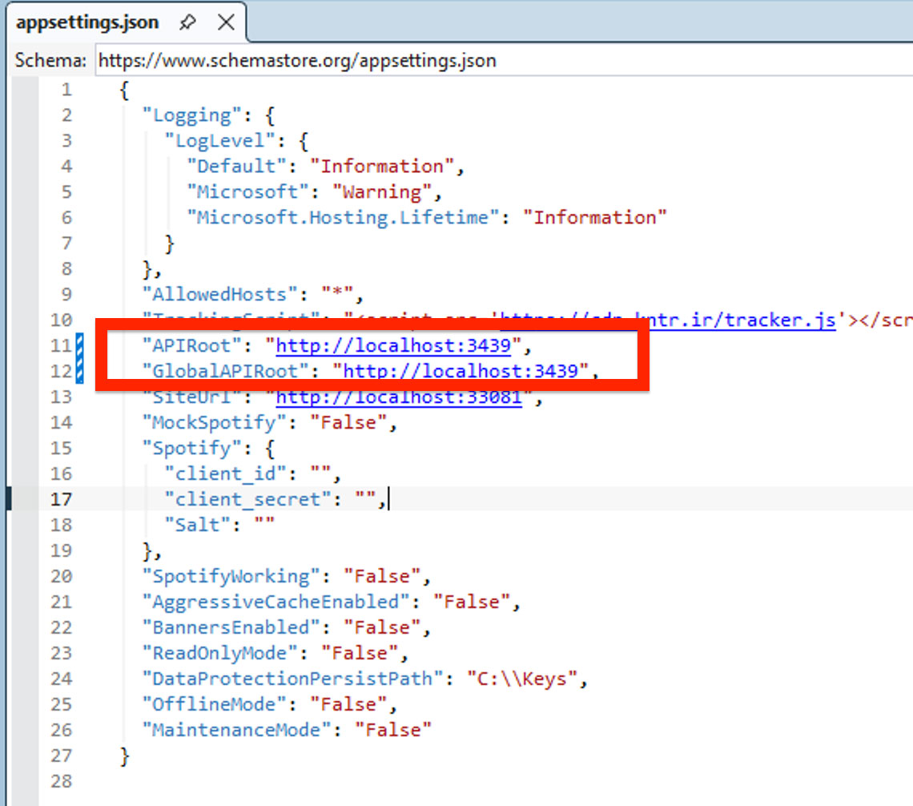
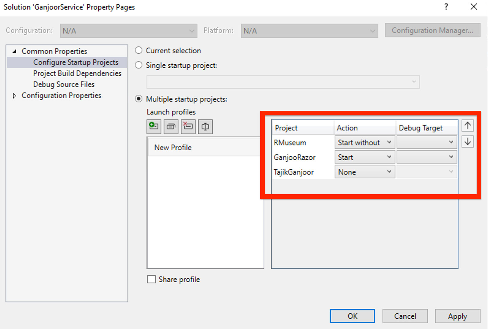
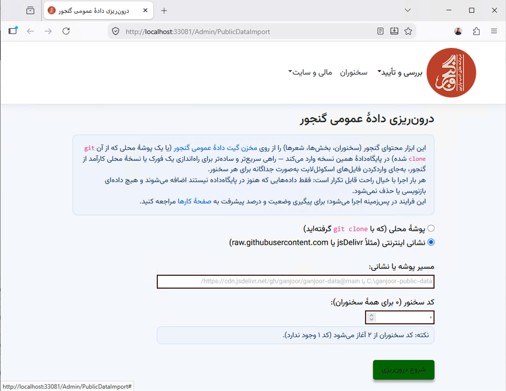

# Running GanjoorService Locally — A Beginner's Guide

This walks through getting the whole GanjoorService solution — the API backend (`RMuseum`) and
the public site (`GanjooRazor`) — running on your own machine, with real poetry content in it.

## What you need first

- **Windows.** `RMuseum` and `GanjooRazor` both target `net10.0-windows7.0` and rely on SQL
  Server LocalDB — both are Windows-specific, so this project doesn't currently build or run on
  Linux/macOS as-is.
- **Visual Studio 2022 or newer**, with the **"ASP.NET and web development"** workload installed.
  That workload also brings in **IIS Express** and **SQL Server Express LocalDB**, both of which
  this guide relies on.
- **Git.**
- **.NET 10 SDK** — a recent enough Visual Studio installs this for you; run `dotnet --version` to
  confirm.

## 1. Clone and open the solution

```
git clone https://github.com/ganjoor/GanjoorService.git
```

Open `GanjoorService.sln` in Visual Studio. The solution has three web projects:

| Project | What it is |
|---|---|
| `RMuseum` | The backend API (ASP.NET Core Web API) — everything else talks to this |
| `GanjooRazor` | The public-facing ganjoor.net website (Razor Pages) |
| `TajikGanjoor` | The Tajik-script (Cyrillic) mirror site — optional for local dev |

## 2. Point GanjooRazor at your local API

Open `GanjooRazor/appsettings.json` (or, better, `GanjooRazor/appsettings.Development.json`, so
you never risk accidentally committing a local URL). By default it points at the **live
production** API:

```json
"APIRoot": "https://api.ganjoor.net",
"GlobalAPIRoot": "https://api.ganjoor.net",
```

Change both to your local RMuseum address instead. `http://localhost:3439` is RMuseum's default
IIS Express URL (see `RMuseum/Properties/launchSettings.json`):



```json
"APIRoot": "http://localhost:3439",
"GlobalAPIRoot": "http://localhost:3439",
```

`SiteUrl` already defaults to `http://localhost:33081` (GanjooRazor's own IIS Express URL) and
normally doesn't need changing.

**If you skip this step**, your local site will still run — but it'll be reading and writing the
real production ganjoor.net data instead of your own local database, which is almost never what
you want for local development.

## 3. Database

`RMuseum/appsettings.json` already points at a local SQL Server LocalDB instance by default:

```json
"ConnectionStrings": {
  "DefaultConnection": "Server=(localdb)\\mssqllocaldb;Database=museum;Trusted_Connection=True;MultipleActiveResultSets=true"
},
"DatabaseMigrate": "True",
```

With `DatabaseMigrate` set to `"True"`, RMuseum applies EF Core migrations automatically on
startup, creating the (empty) `museum` database the first time it runs. You don't need to run any
migration commands by hand.

Two folders it also expects to exist and be writable:

```json
"PictureFileService": {
  "StoragePath": "C:\\museum",
  "TrashStoragePath": "C:\\museum-trash"
},
"DataProtectionPersistPath": "C:\\Keys",
```

Create `C:\museum`, `C:\museum-trash`, and `C:\Keys` (or point these settings somewhere more
convenient) before your first run.

## 4. Set up multiple startup projects

You need both `RMuseum` (the API) and `GanjooRazor` (the site) running at once. Right-click the
**GanjoorService** solution in Solution Explorer → **Properties** → **Common Properties → Startup
Project** → **Multiple startup projects**, and set:



| Project | Action |
|---|---|
| `RMuseum` | Start without debugging |
| `GanjooRazor` | Start |
| `TajikGanjoor` | None |

("Start without debugging" for RMuseum just means you won't be stepping through its code with
breakpoints — it still runs fine. Set it to "Start" too if you want to debug the API itself.)

For each project, also make sure its **debug target** (the dropdown next to the green ▶ button,
or Project Properties → Debug) is set to **IIS Express**, not the plain "Project"/Kestrel profile
— the ports above (3439 / 33081) are IIS Express's. The plain Kestrel profile for both projects
defaults to the same port (5000), which will collide if you run both at once.

## 5. First run

Press **F5** (or Ctrl+F5). Both projects start, and a browser opens to GanjooRazor's home page.

Since the database is brand new and empty, you'll be redirected — first to a login/signup page
(if you're not already logged in), then automatically to an **admin data-import page**:



This is expected, not an error — an empty database has no poets yet, so there's nothing to show
on the home page, and Ganjoor routes you here instead of showing a broken page.

## 6. Create your admin account

If you don't already have an account, go to `/signup` and register using the email address
configured as `RSecurityBackend:FirstUserEmail` in `RMuseum/appsettings.json` — by default:

```json
"RSecurityBackend": {
  "FirstUserEmail": "admin@ganjoor.net"
}
```

The very first account created with that exact email address automatically becomes the site's
admin. (You can use a different email if you'd rather — just update `FirstUserEmail` to match
before signing up.)

## 7. Import real content

On the import page you landed on in step 5 (or reach it any time via **Admin → مالی و سایت →
درون‌ریزی دادهٔ عمومی**), you have two choices for where to read data from:

- **Internet URL** — the easiest option, nothing to download first:
  ```
  https://cdn.jsdelivr.net/gh/ganjoor/ganjoor-data@main/
  ```
- **Local folder** — if you've already run `git clone https://github.com/ganjoor/ganjoor-data.git`
  somewhere on disk, point it at that folder instead. Faster for repeated imports, and doesn't
  depend on your internet connection each time you run it.

**Poet id** — leave it at `0` to import every poet (the full corpus; can take a while), or enter a
specific poet's numeric id to import just that one for quicker local testing. Poet ids start at
`2`, not `1`.

Click **شروع درون‌ریزی** ("start import"). The job runs in the background — track its progress on
the **Admin → کارها** (Jobs) page. Once it finishes, refresh the home page: your local Ganjoor now
has real poets, poems, and categories in it.

Re-running the import later (e.g. to pick up a poet you skipped the first time) is always safe —
it only adds what's missing, and never duplicates or overwrites content already in your database.

## Troubleshooting

- **RMuseum won't start / complains about the database** — make sure SQL Server Express LocalDB
  is installed. It's part of Visual Studio's "ASP.NET and web development" workload; if it's
  missing, add it via the Visual Studio Installer → Individual Components → "SQL Server Express
  LocalDB".
- **GanjooRazor loads but every page errors** — almost always means `APIRoot`/`GlobalAPIRoot` in
  `GanjooRazor/appsettings.json` is still pointing at `https://api.ganjoor.net` instead of your
  local RMuseum address, or RMuseum simply isn't running. Re-check step 2.
- **"Port already in use"** — something else on your machine already has 3439 or 33081. Either
  free that port, or change it in the relevant project's `Properties/launchSettings.json` and
  update `APIRoot`/`GlobalAPIRoot`/`SiteUrl` to match.
- **The import page 401s / "Unauthorized"** — you're logged in as an account that isn't
  recognized as admin. Confirm you signed up with the exact email set in `FirstUserEmail`.
